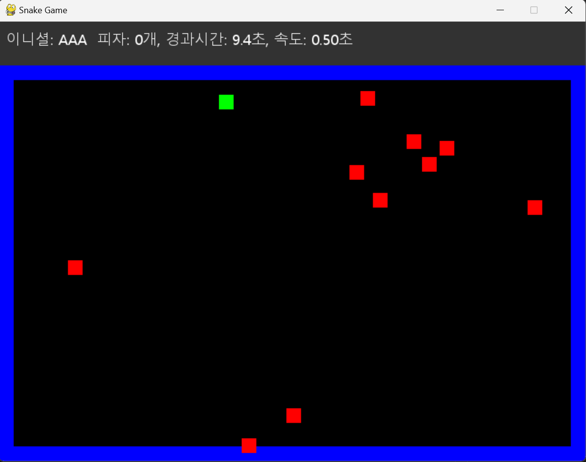

# 게임 설명

이 게임은 파이썬과 pygame을 사용하여 만든 클래식 뱀 게임입니다.
게임의 주요 목표는 피자를 먹으며 뱀을 성장시키고, 벽 및 자기 자신과의 충돌을 피하는 것입니다.

## 게임 특징

- 간단하고 직관적인 게임 플레이
- 피자 섭취로 인한 뱀의 성장 및 속도 변화
- 시작화면과 엔딩 화면에 표시되는 사용자 인터페이스(UI)
- 게임 종료 조건: 벽 충돌, 자기 자신과의 충돌, ESC 또는 Q 키 입력

## 게임 스샷

2025-02-10
